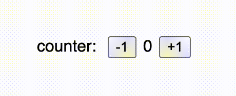
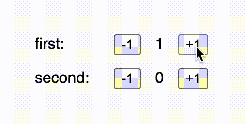
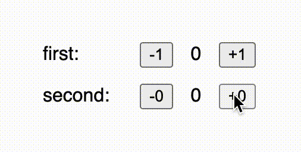
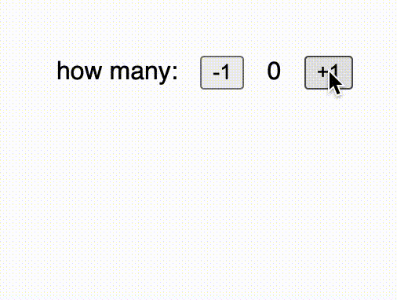

# Composition Comparison

**What is this?**

This repository houses a collection of UI-framework compsition challenges.
It identifies a few patterns for how composing components, and implements them
using Bonsai and Elm (React+Redux is on the way!)

**Is this supposed to be unbiased?**

Not really,

1. I'm pretty good at Bonsai, and pretty bad at Elm
2. I designed Bonsai with automatic component composition as a primary goal


# 01 - Components

What is a "UI component" anyway?  To me, a component denotes a group of code
with the following properties:

1. **It serves as an abstraction** &mdash; Users of the component shouldn't need
   to know about any implementation details
2. **It's built to be composed with other components** &mdash; It's right there
   in the name!  Components must be robust to being combined with one another
3. **Encapsulated** &mdash; A component shouldn't leak private details, nor should
   it require composition with other components in order to be useful. 

For the rest of this series, we're going to be looking at ways to compose 
a very basic "counter" component. 

## Defining a component




The counter component that we'll be building is a basic widget that maintains a
count (as an integer), and two buttons, one to decrease the stored value, and 
another to increase it.

Our counter components will be configurable in two ways:

1. The user of the counter component can pick a text label to display
2. The caller can also pick the delta by which the increment and decrement 
   buttons will modify the stored value

The user of the component will also probably want access to the value in 
some way, which the component should also provide.


<table>
<tr>
<th>Bonsai</th>
<th>Elm</th>
</tr>
<tr>
<td valign="top">


<!-- $MDX file=shared/counter.ml -->
```ocaml
open! Core
open! Import

module Action = struct
  type t =
    | Incr
    | Decr
  [@@deriving sexp_of]
end

let apply_action ~inject:_ ~schedule_event:_ by model action =
  match (action : Action.t) with
  | Incr -> model + by
  | Decr -> model - by
;;

let component' ~label ?(by = Value.return 1) () =
  let%sub state_and_inject =
    Bonsai.state_machine1
      (module Int)
      (module Action)
      ~default_model:0
      ~apply_action
      by
  in
  let%arr state, inject = state_and_inject
  and by = by
  and label = label in
  let button op action =
    let attr = A.on_click (fun _ -> inject action) in
    N.button ~attr [ N.textf "%s%d" op by ]
  in
  let view =
    N.div
      [ Vdom.Node.span [ N.textf "%s: " label ]
      ; button "-" Decr
      ; Vdom.Node.span [ N.textf "%d" state ]
      ; button "+" Incr
      ]
  in
  view, state
;;

let component ~label ?by () =
  let%map.Computation view, _ = component' ~label ?by () in
  view
;;
```

</td>
<td valign="top">

<!-- $MDX file=shared/Counter.elm -->
```elm
module Counter exposing (Model, Msg, init, update, view)

import Browser
import Html exposing (Html, div, span, text)
import Html.Events exposing (onClick)


type alias Model =
    Int


init : Model
init =
    0


type Msg
    = Increment
    | Decrement


update : Int -> Msg -> Model -> Model
update howMuch msg model =
    case msg of
        Increment ->
            model + howMuch

        Decrement ->
            model - howMuch


view : Int -> String -> Model -> Html Msg
view howMuch label model =
    let
        button op action =
            Html.button [ onClick action ] [ text (String.concat [ op, String.fromInt howMuch ]) ]
    in
    div []
        [ text (String.concat [ label, ": " ])
        , button "-" Decrement
        , text (String.fromInt model)
        , button "+" Increment
        ]
```

</td> <td valign="top">

<!-- $MDX file=shared/Counter.jsx -->
```jsx
import React from 'react';

export const defaultState = 0;

export function applyAction(state, { action, by }) {
  switch (action) {
    case 'increment':
      return state + by;
    case 'decrement':
      return state - by;
    default:
      console.error('BUG');
  }
}

const Counter = ({ label, by, state, inject }) => {
  let increment = () => inject({ action: 'increment', by });
  let decrement = () => inject({ action: 'decrement', by });
  return (
    <div>
      {label}:<button onClick={decrement}> -{by}</button>
      {state}
      <button onClick={increment}> +{by}</button>
    </div>
  );
};

export default Counter;
```
</td>
</tr>
<tr><td valign="top">

This Bonsai component is exposed to users through the `component` and
`component'` functions.  You'll notice that we use regular OCaml functions to
pass properites to the component, like `~label` and the optional `?by`
parameters.

While the `component'` function produces a component that yields both the view _and_ 
the counter value, we also derive a `component` function that drops the current value
on the floor, making it easier to use by callers that don't care about the value.

You'll also notice that in defining `Counter.component'`, we use `Bonsai.state_machine1`.
`state_machine1` is a primitive component that we use to build our bigger component.
The `1` indicates that the state machine has access to one input value that it can 
read when processing an action.

</td><td valign="top">

This elm component is in the shape of a whole module which exports its initial model,
transition function, and view calculations separately for the user to compose.  Notice
how the update function takes an integer to determine how much the state should be 
increased or decreased by, and how the view function also requires that value in addition
to a string to use for the label.

</td></tr>
</td><td valign="top">

TODO

</td></tr>
</table>

Since Bonsai was originally modeled after the Elm Architecture, it shouldn't
be super surprising that defining a component looks similar in both languages.
Both focus on the state for a component being modeled as a state-machine, with
explicit model and and action types which correspond to states and state 
transitions.

## Using a component

The "topmost" component in an application is sometimes referred to as the 
"application component".  These can be as big or as small as necessary, so let's 
start out with the smallest app-component possible: a single counter.

<table>
<tr>
<th>Bonsai</th>
<th>Elm</th>
</tr>
<tr>
<td valign="top">

<!-- $MDX file=01-basic/bonsai/main.ml -->
```ocaml
open! Core
open! Import

let app = Counter.component ~label:(Value.return "counter") ()
let () = Start.start app
```

</td> <td valign="top">

<!-- $MDX file=01-basic/elm/Main.elm -->
```elm
module Main exposing (main)

import Browser
import Counter


update =
    Counter.update 1


view =
    Counter.view 1 "counter"


main =
    Browser.sandbox { init = Counter.init, update = update, view = view }
```

</td>
</td> <td valign="top">

<!-- $MDX file=01-basic/react/App.jsx -->
```js
import React, {useReducer } from 'react';
import Counter, {applyAction, defaultState} from '../../shared/Counter'

const App = ({ title }) => {
    let [state, inject] = useReducer(applyAction, defaultState);
    return <Counter label="counter" by={1} state={state} inject={inject} />;
}

export default App;
```

</td>
</tr>
<tr><td valign="top">

Because the application component is an instance of our counter component, we need 
to invoke the component-generating function with its required parameters.  Because 
we're fine with the default `by` argument being `1`, we only need to provide the value 
for the label.

</td><td valign="top">

The Elm component requires passing all the configuration to all the different pieces 
of the component separately.  Make sure that you keep both of the `by` values in sync!

</td><td valign="top">

TODO

</td></tr>
</table>


# 02 - Parallel Composition



"Parallel Composition" is a term that I came up with for describing the style of
composing components that are completely isoloated from one another.  Not only are
these components visually separated, they're also logically separated, removing or 
changing one would have no impact on the other.

<!-- https://web.archive.org/web/20160816034346/https://guide.elm-lang.org/architecture/modularity/counter_pair.html -->

<table>
<tr>
<th>Bonsai</th>
<th>Elm</th>
</tr>
<tr>
<td valign="top">

<!-- $MDX file=02-parallel/bonsai/main.ml -->
```ocaml
open! Core
open! Import

let app =
  let%sub first = Counter.component ~label:(Value.return "first") () in
  let%sub second = Counter.component ~label:(Value.return "second") () in
  let%arr first = first
  and second = second in
  N.div [ first; second ]
;;

let () = Start.start app
```

</td><td valign="top">

<!-- $MDX file=02-parallel/elm/Main.elm -->
```elm
module Main exposing (main)

import Browser
import Counter
import Html exposing (Html, div)


type alias Model =
    { first : Counter.Model, second : Counter.Model }


init : Model
init =
    { first = Counter.init, second = Counter.init }


type Msg
    = First Counter.Msg
    | Second Counter.Msg


update : Msg -> Model -> Model
update msg model =
    case msg of
        First msg_first ->
            { model | first = Counter.update 1 msg_first model.first }

        Second msg_second ->
            { model | second = Counter.update 1 msg_second model.second }


view : Model -> Html Msg
view model =
    div []
        [ Html.map First (Counter.view 1 "first" model.first)
        , Html.map Second (Counter.view 1 "second" model.second)
        ]


main =
    Browser.sandbox { init = init, update = update, view = view }
```

</td><td valign="top">

<!-- $MDX file=02-parallel/react/App.jsx -->
```jsx
import React, { useReducer } from 'react';
import Counter, { applyAction, defaultState } from '../../shared/Counter';

const App = ({ title }) => {
  let [state1, inject1] = useReducer(applyAction, defaultState);
  let [state2, inject2] = useReducer(applyAction, defaultState);
  return (
    <div>
      <Counter label="first" by={1} state={state1} inject={inject1} />
      <Counter label="second" by={1} state={state2} inject={inject2} />
    </div>
  );
};

export default App;
```
</td>
</tr>
<tr><td valign="top">

For Bonsai, we use `let%sub` to create new instances of the component, 
and then `let%arr` to compose the views produced by those instances.

</td><td valign="top">

In Elm there's some more boilerplate involved.  The application-component 
is now bigger, and that means that we need a new model and action type to 
go along with it.

Just like in the Bonsai example, we need to compose the views of these 
components manually (there's no way around this if you want precise control
of the view).  However, we also need to call `Html.map`, which is used to 
transform the type of the message produced by the view.

More apparent is our need to implement an `update` function which dispatches 
actions to the correct component.

</td><td valign="top">

TODO

</td></tr>
</table>

Fun fact: Bonsai got its name from parallel-composition!  If you visualize
the structure of components that are composed in parallel, it looks like a 
little tree; hence the name "Bonsai!"  Sadly it wasn't until after 1.0 that 
we realized that its real power was sequential composition...


# 03 - Sequential Composition



Components are composed sequentially when there's a dependency relationship
between them.  They are no longer independent, and the state of one component
can influence the other.

In this demo, we'll use the counter value of one component to modify the 
delta parameter on the other.


<table>
<tr>
<th>Bonsai</th>
<th>Elm</th>
</tr>
<tr>
<td valign="top">

<!-- $MDX file=03-sequential/bonsai/main.ml -->
```ocaml
open! Core
open! Import

let app =
  let%sub first_view, by =
    Counter.component' ~label:(Value.return "first") ()
  in
  let%sub second_view =
    Counter.component ~label:(Value.return "second") ~by ()
  in
  let%arr first = first_view
  and second = second_view in
  N.div [ first; second ]
;;

let () = Start.start app
```

</td> <td valign="top">

<!-- $MDX file=03-sequential/elm/Main.elm -->
```elm
module Main exposing (main)

import Browser
import Counter
import Html exposing (Html, div)


type alias Model =
    { first : Counter.Model, second : Counter.Model }


init : Model
init =
    { first = Counter.init, second = Counter.init }


type Msg
    = First Counter.Msg
    | Second Counter.Msg


update : Msg -> Model -> Model
update msg model =
    case msg of
        First msg_first ->
            { model | first = Counter.update 1 msg_first model.first }

        Second msg_second ->
            { model | second = Counter.update model.first msg_second model.second }


view : Model -> Html Msg
view model =
    div []
        [ Counter.view 1 "first" model.first |> Html.map First
        , Counter.view model.first "second" model.second |> Html.map Second
        ]


main =
    Browser.sandbox { init = init, update = update, view = view }
```

</td> <td valign="top">

<!-- $MDX file=03-sequential/react/App.jsx -->
```jsx
import React, { useReducer } from 'react';
import Counter, {
  applyAction as counterApplyAction,
  defaultState as counterDefaultState,
} from '../../shared/Counter';

const defaultState = {
  first: counterDefaultState,
  second: counterDefaultState,
};

function applyAction(state, { which, subAction }) {
  switch (which) {
    case 'first':
      return {
        ...state,
        first: counterApplyAction(state.first, subAction),
      };
    case 'second':
      return {
        ...state,
        second: counterApplyAction(state.second, subAction),
      };
  }
}

const App = ({ title }) => {
  let [state, inject] = useReducer(applyAction, defaultState);
  let injectFirst = (subAction) => inject({ which: 'first', subAction });
  let injectSecond = (subAction) => inject({ which: 'second', subAction });
  return (
    <div>
      <Counter label="first" by={1} state={state.first} inject={injectFirst} />
      <Counter
        label="second"
        by={state.first}
        state={state.second}
        inject={injectSecond}
      />
    </div>
  );
};

export default App;
```
</td>
</tr>
<tr><td valign="top">

We finally get to use `Counter.component'`!  This is the variant that returns its 
current state in addition to its view.  We bind the value, and immediately pass it 
into the next component through its optional parameter.  The rest of the code should
be very familiar.

</td><td valign="top">

On the Elm side, the code looks very similar to the code from the "parallel composition"
example above, but the differences matter a lot!  The main change is that calling the 
second counter-component's `update` and `view` functions, instead of passing in `1` for
"how much to increase or decrease the value by", we reach in to the model of the first 
component to pull out the currently stored value.  I'll be honest, this makes me feel 
a bit icky; I'd love to know if there's a better way to do this.

</td><td valign="top">

TODO

</td></tr>
</table>

# 04 - Multiplicity



So far we've dealt with a constant number of components, but determining the number of 
components in an app at runtime is a common requirement.  For this example, we'll use the
current value of one counter component to determine how many more counter-components 
should be on the page.

An important additional restriction is that subcomponent state should be persisted for 
compoenents even when they aren't currently active.


<table>
<tr>
<th>Bonsai</th>
<th>Elm</th>
</tr>
<tr>
<td valign="top">

<!-- $MDX file=04-multiplicity/bonsai/main.ml -->
```ocaml
open! Core
open! Import

let app =
  let%sub counter_view, how_many =
    Counter.component' ~label:(Value.return "how many") ()
  in
  let%sub map =
    let%arr how_many = how_many in
    List.init how_many ~f:(fun i -> i, ()) |> Int.Map.of_alist_exn
  in
  let%sub others = Bonsai.assoc (module Int) map ~f:(fun key _data ->
    let label = Value.map key ~f:Int.to_string in
    Counter.component ~label ())
  in
  let%arr counter_view = counter_view
  and others = others in
  N.div (counter_view :: Map.data others)
;;

let () = Start.start app
```

</td><td valign="top">

<!-- $MDX file=04-multiplicity/elm/Main.elm -->
```elm
module Main exposing (main)

import Browser
import Counter
import Dict exposing (Dict)
import Html exposing (Html, div, map)


type alias Model =
    { howMany : Counter.Model, others : Dict Int Counter.Model }


init : Model
init =
    { howMany = Counter.init, others = Dict.empty }


type Msg
    = HowMany Counter.Msg
    | ForKey Int Counter.Msg


updateOther which msg =
    Dict.update which
        (\m ->
            Just (Counter.update 1 msg (Maybe.withDefault 0 m))
        )


update : Msg -> Model -> Model
update appMsg model =
    case appMsg of
        HowMany msgHowMany ->
            { model | howMany = Counter.update 1 msgHowMany model.howMany }

        ForKey which msg ->
            { model | others = updateOther which msg model.others }


viewOther : Dict Int Counter.Model -> Int -> Html Counter.Msg
viewOther models key =
    case Dict.get key models of
        Just model ->
            Counter.view 1 (String.fromInt key) model

        Nothing ->
            Counter.view 1 (String.fromInt key) Counter.init


view : Model -> Html Msg
view model =
    List.range 0 (model.howMany - 1)
        |> List.map (\i -> Html.map (ForKey i) (viewOther model.others i))
        |> List.append [ Html.map HowMany (Counter.view 1 "how many" model.howMany) ]
        |> div []


main =
    Browser.sandbox { init = init, update = update, view = view }
```

</td><td valign="top">

<!-- $MDX file=04-multiplicity/react/App.jsx -->
```jsx
import React, { useReducer } from 'react';
import Counter, {
  applyAction as counterApplyAction,
  defaultState as counterDefaultState,
} from '../../shared/Counter';

const defaultState = {};

function applyAction(state, { which, subAction }) {
  return {
    ...state,
    [which]: counterApplyAction(state[which] || 0, subAction),
  };
}

const App = ({ title }) => {
  let [howMany, injectHowMany] = useReducer(
    counterApplyAction,
    counterDefaultState
  );
  let [subcomponentState, subcomponentInject] = useReducer(
    applyAction,
    defaultState
  );
  let subcomponents = Array.from({ length: howMany }, function (_, i) {
    let injectMe = (subAction) => subcomponentInject({ which: i, subAction });
    return (
      <Counter
        key={i}
        label={i}
        by={1}
        state={subcomponentState[i] || 0}
        inject={injectMe}
      />
    );
  });
  return (
    <div>
      <Counter
        label="how many"
        by={1}
        state={howMany}
        inject={injectHowMany}
      />
      {subcomponents}
    </div>
  );
};

export default App;
```
</td>
</tr>
<tr><td valign="top">

For Bonsai, this one is a bit hacky, I'll admit! `Bonsai.assoc` reads  an input
map and creates an instance of the provisded component for each key/value pair
in the map.  Because it needs that input map, we first make a map from `int` to 
`unit`, and pass that into `assoc`.  Usually `assoc` is given a map that actually 
has some meaning - like rows in a table - and aren't built at the last second just 
to give to the function.

</td><td valign="top">

I'll admit, I know this code could be written better, but I don't really know where 
to start.  One thing is certain though; the pattern of storing models in a map 
and keeping the model map separate from the "what is visible" state is necessary,
so I think this general pattern will always exist.

</td><td valign="top">

TODO

</td></tr>
</table>
